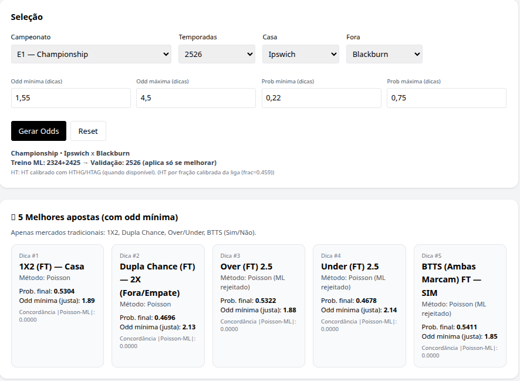
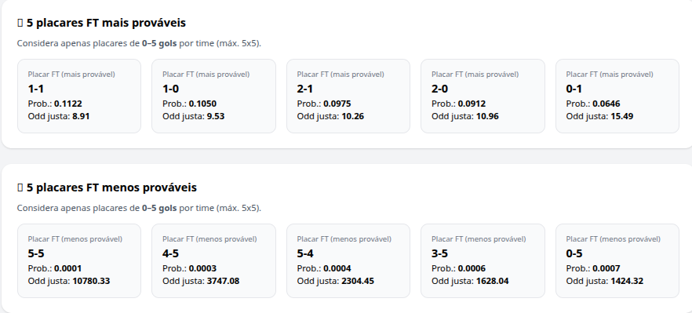
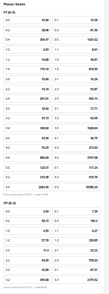

# Futebol Odds Platform ⚽ (Poisson + ML)

Plataforma educacional para **estimativa de probabilidades e odds justas (sem margem)** no futebol, utilizando modelos estatísticos clássicos e **calibração por Machine Learning apenas quando validada**.

> ⚠️ **Sem promessa de lucro.**  
> Este projeto tem finalidade **educacional e analítica**, fornecendo estimativas estatísticas transparentes.

---

## 🌐 Demo online
👉 https://futebol-odds.onrender.com

---

## 📸 Screenshots

### Tela principal (seleção + dicas)


### Placares mais e menos prováveis


### Placar exato FT / HT


---

## ⚙️ Funcionalidades

- Seleção de **liga / temporada / time casa / time fora**
- Filtros configuráveis:
  - Odd mínima / máxima
  - Probabilidade mínima / máxima
- Mercados tradicionais:
  - **1X2 (FT)**
  - **Dupla Chance (FT): 1X / 12 / 2X**
  - **BTTS (Ambas Marcam)** FT e HT (SIM / NÃO)
  - **Over / Under** FT e HT (Over e Under)
- **Placar Exato FT e HT**
  - Top 5 placares mais prováveis
  - Top 5 placares menos prováveis
  - Limite estatístico: **0–5 gols por time**

---

## 📊 Dados utilizados

- Fonte oficial: **Football-Data (mmz4281)**
- Temporadas consideradas:
  - 2023/24
  - 2024/25
  - 2025/26
- Aplicação de **ponderação por recência** para equilibrar volume e atualidade

---

## 🧠 Metodologia

### Modelo Poisson (baseline estatístico)
- Estimativa de forças de **ataque e defesa** por time
- Separação entre desempenho **em casa** e **fora**
- Normalização pela média de gols da liga
- Aplicação de fator de **vantagem de mando**
- Geração de matriz de probabilidades de placar (truncada)

A partir da matriz são derivados:
- 1X2
- Dupla Chance
- Over / Under
- BTTS
- Placar Exato

---

### 1º Tempo (HT)
- Utiliza dados de gols no HT quando disponíveis no dataset
- Caso contrário, aplica **fallback calibrado pela própria liga**
- Evita uso de frações arbitrárias do jogo

---

### Machine Learning (calibração)
- Utiliza probabilidades Poisson como feature principal
- Inclui variáveis de contexto (liga, times, forças estimadas)
- Validação **temporal**:
  - Treino: temporadas mais antigas
  - Validação: temporada mais recente
- **ML só é aplicado quando melhora métricas**:
  - LogLoss
  - Brier Score

Caso contrário, o sistema mantém **exclusivamente o Poisson**.

---

## ▶️ Rodar local (Linux)

```bash
cd ~/futebol-odds
python3 -m venv .venv
source .venv/bin/activate
pip install -r requirements.txt
python app.py

Abra no navegador:
👉 http://localhost:8000

⚠️ Aviso importante

Este projeto:

❌ Não recomenda apostas

❌ Não promete lucro

✅ Fornece análise estatística transparente e calibração quando validada

📄 Licença

MIT — ver arquivo LICENSE.
